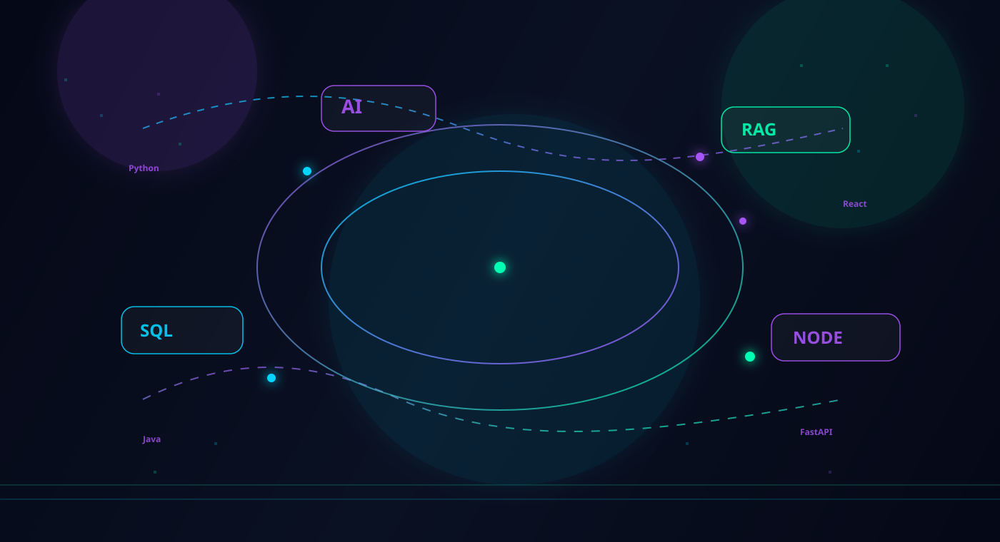
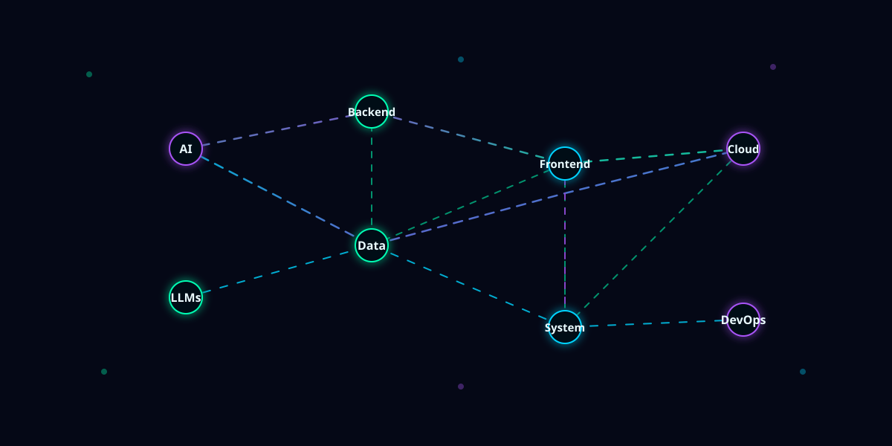
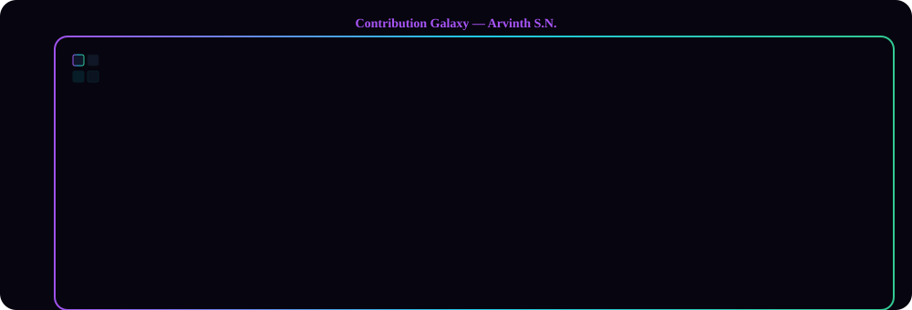
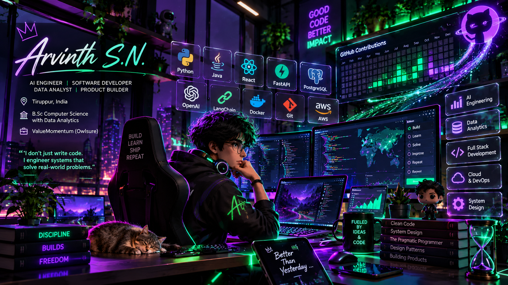
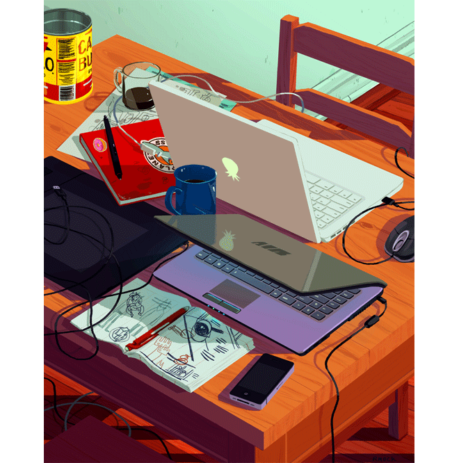

<!--
GitHub README — Premium AI Engineer Portfolio
Designed for: Arvinth S.N.
Theme: Neon violet and black, electric blue, emerald green, glassmorphism, cyberpunk
-->

<div align="center">
  
</div>

<div align="center">
  
</div>

<div align="center">
  
</div>

## ⚡ React Motion Banner

React/Framer Motion examples removed from this README to keep the profile clean. If you'd like a runnable demo or a separate example project, tell me and I'll scaffold it in the repo.

---

<h1 align="center">
  <span style="color:#A855F7;">Arvinth</span>
  <span style="color:#00D4FF;">S.N.</span>
</h1>

<p align="center">
  
  
  
  
</p>

<p align="center">
  
  
</p>

> "I don't just write code. I engineer systems that solve real-world problems."

<div align="center">
  
  
</div>

---

## 🧠 3D Developer Card

<table>
  <tr>
    <td width="220" align="center">
      
    </td>
    <td valign="middle">
      <h3 style="color:#A855F7; margin: 0 0 8px 0;">AI Engineer • Software Engineer • Data Analyst • Full Stack Developer</h3>
      <p><strong>📍</strong> Tiruppur, India</p>
      <p><strong>💼</strong> ValueMomentum (Owlsure)</p>
      <p><strong>🎓</strong> B.Sc Computer Science with Data Analytics</p>
      <p><strong>⚡</strong> Current Focus: AI systems, product engineering, backend architecture, analytics</p>
    </td>
  </tr>
</table>

---

## 🏆 Achievement Timeline

<div align="center">
  
  
  
</div>

- 🏆 Best Trainee Award
- 🥈 NPTEL Java Silver Medal
- 🎓 IIT Madras Python for Data Science
- 🏅 NPTEL Programming in C
- 📊 Datathon Third Place
- 🤝 NSS Participation
- 💼 NitroWare Internship

---

## ⚙️ 3D Tech Stack

<div align="center">
  
</div>

### Languages
- Java
- Python
- SQL
- C

### Frontend
- React
- Tailwind
- JavaScript

### Backend
- FastAPI
- Spring Boot
- Node.js

### Databases
- PostgreSQL
- MongoDB
- Supabase

### AI
- OpenAI
- LangChain
- RAG
- Qdrant

### Data
- Power BI
- Tableau
- Pandas
- NumPy

### DevOps
- Docker
- Git

---

## 📈 Contributions (Live)

The contribution gallery below is generated from your GitHub contributions and updated by running the script in `scripts/generate_contrib_svg.py`.

To regenerate with your username run:

```bash
python scripts/generate_contrib_svg.py --username YOUR_GITHUB_USERNAME
```

This produces `Assets/contrib-3d-52x.svg` which the README references. Run it locally, then commit and push to update the gallery on GitHub.

<div align="center">
  
</div>

- GitHub
- Linux

---

## 🧠 Animated Skill Matrix

<div align="center">
  
</div>

- AI
- Backend
- Frontend
- Cloud
- Data
- System Design

---

## 🚀 Featured Projects

### SYNOVA
AI Insurance Aggregator • Voice Agent • RAG • OCR • FastAPI • React • PostgreSQL

<div align="center">
  
</div>

### Global LLM Market Analytics
ETL • Power BI • PostgreSQL • Hugging Face • Analytics

<div align="center">
  
</div>

### AI Call Center Analytics
Speech to Text • NLP • Classification • Real-Time Monitoring

<div align="center">
  
</div>

---

## 📊 Advanced GitHub Stats

<div align="center">
  
  
</div>

<div align="center">
  
</div>

---

## 🐍 Feeding My Consistency Every Day

<div align="center">
  
</div>

> Success is consistency compounded.

---

## 🌌 Contribution Galaxy

Every commit tells a story.

<div align="center">
  
</div>

---

## 🌟 Developer Philosophy

> Build before you're ready.

> Consistency beats motivation.

> The future belongs to engineers who combine AI with software.

> Every bug is a lesson in disguise.

> Learn. Build. Share. Repeat.

---

## 🔗 Connect

<div align="center">
  <a href="https://github.com/ArvinthSN" target="_blank">
    
  </a>
  <a href="https://www.linkedin.com/in/arvinth-s-n/" target="_blank">
    
  </a>
  <a href="mailto:arvinthsn.dev@gmail.com">
    
  </a>
</div>

> Build. Learn. Ship. Repeat.

---

<div align="center">
  
</div>

---

## 😂 Comedy Corner

A little levity before the finale — because engineers need memes.

<div align="center">
  
  
</div>

<p align="center"><em>When in doubt, debug with coffee ☕ and memes.</em></p>

---

<div align="center">
  <h2 style="color:#A855F7; margin: 8px 0 4px 0;">THANK YOU</h2>
  <p style="color:#22d3ee; margin: 0 0 18px 0;">Thanks for visiting — let’s build something awesome together.</p>
</div>
